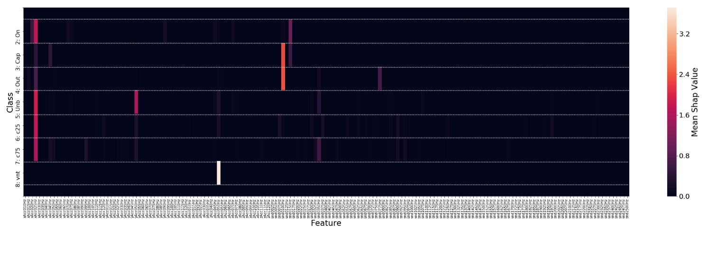

# Project XAI 

## Team and project  description
*This is the documentation of the result of an university project work of the HTW university of applied science. Developed by a group of Master students in mechanical engineering. The aim is to investigate different methods for determining relevant properties of the classification. For this purpose, forms of dimension reduction are also to be considered. The results from this are to be suitably visualized and evaluated with previously defined criteria.*

**Team members:**

*   Paul-Albert Bartlau ([GitHub](https://github.com/technojesusB), [LinkedIn](https://www.linkedin.com/in/paul-bartlau-280a2990/))
*   Maurice Lucas Dörnte
*   Tim Dieter Eberhardt ([GitHub](https://github.com/tde96), [LinkedIn](https://www.linkedin.com/in/tim-eberhardt-8a27a4196/))
*   Tim Lukas Schröter ([GitHub](https://github.com/Timmey160593))
*   Raphael Wallsberger ([GitHub](https://github.com/RoitRapha), [LinkedIn](https://www.linkedin.com/in/raphael-wallsberger-0698a01b9/))

## Repository structure
*Note: all the notebooks are safed as google colab notebooks and therefore easily accessible. Furthermore, there are detailed descriptions within every notebook about the methods and workflows*

- [Original dataset (frequency features + audio recordings)](dataset/)
- [Notebook with the main work](XAI_SHAP_UMAP_Colab.ipynb)
- [Additional Soundanalysis notebook](Soundanalysis_Colab.ipynb) 
- [Additional Sankey Plot notebook](Sankey_Plot_Colab.ipynb) 
- [The feature ranking over max tree depth export file (used in the main notebook)](feature_ranking_max_depth.xlsx) 

### Dataset - frequencyFeatures.csv
The used dataset (file: frequencyFeatrues.csv + audio recording) is from the following paper and you can download it with the following link:

*Paper: S. Matzka, J. Pilz and A. Franke, "Structure-borne and Air-borne Sound Data for Condition Monitoring Applications," 2021 4th International Conference on Artificial Intelligence for Industries (AI4I), 2021, pp. 1-4, doi: 10.1109/AI4I51902.2021.00009.*

Link: https://archive.ics.uci.edu/ml/datasets/AI4I+2020+Predictive+Maintenance+Dataset
## Methods

In this work, the XAI algorithm SHAP and the dimensionality reduction method UMAP were selected for further determination of relevant properties. The UMAP algorithm achieves very good results on high dimensional data and comparatively preserves the global and local relationships of the dataset very well. The SHAP algorithm is based on the "shapley values" and thus on a solid theoretical (game theory) and mathematical foundation. Especially the latter strengthens the acceptance of the method. Moreover, both local and global explanations can be performed and the predictions are evenly distributed over the feature values. Furthermore, SHAP has a TreeSHAP library that can be applied to tree algorithms and has very short computation time. Other SHAP variants, such as KernelSHAP, are very time and computationally intensive and practically difficult to apply.

In the first step, UMAP is now applied to the dataset to investigate the shapes of the individual class clusters, as well as their relative positions to each other. Also, a suitable tree algorithm is trained on the dataset as a classifier, in this case the XGBoost library. On the one hand because simple trees achieve good results, which are still comprehensible by humans, and on the other hand because of the aforementioned good applicability of TreeSHAP. The good accuracies (Accuracies - Acc) and F1-Scores speak for XGBoost in comparison to SVM and KNN . The next step is a selection of the hyperparameters of the model with different evaluation metrics (F1, Acc,..). The SHAP algorithm is applied to the XGBoost model. Results from this should be the 10 most important features of the classification, which are presented in a suitable form.

The following evaluation system is defined to be able to classify the results and the quality. On the one hand, the metrics Accuracy and F1-Score of the XGBoost are compared with different training data. On the other hand, other types of models (KNN and SVM) are trained with these data and their key figures are also evaluated. The three training datasets consist of: 1. the whole dataset, 2. the 10 most important features from TreeSHAP and 3. 10 random features. 
For an additional auditory representation of the most important features, the data is extracted and then made audible. The extraction includes only the 10 most important features of the data set, the remaining values of the other features are set to zero. Now the data can be transformed from the frequency domain back to the time domain. In the last step, a sound file for each class is generated from the cleaned data. These should give an indication of the type of error when listening.

## Conclusion and future work

The results show that TreeSHAP is an efficient method for determining the features of the dataset that are relevant across models. In addition, a clearly audible difference between the individual classes could be detected during the extraction of the audio files. By reducing the dataset to the 10 most important properties using TreeSHAP, the dimensionality could be greatly reduced without significant loss of information (XGB). In the future, a generalization of the applied methodology can be explored by applying it to other datasets. The features contained in the reduced dataset can be investigated for their physical cause. Also, frequency filters could be applied to the important frequencies to produce an output signal for each class upon error detection. Furthermore, the approach can be further investigated as a dimensionality reduction technique. 
